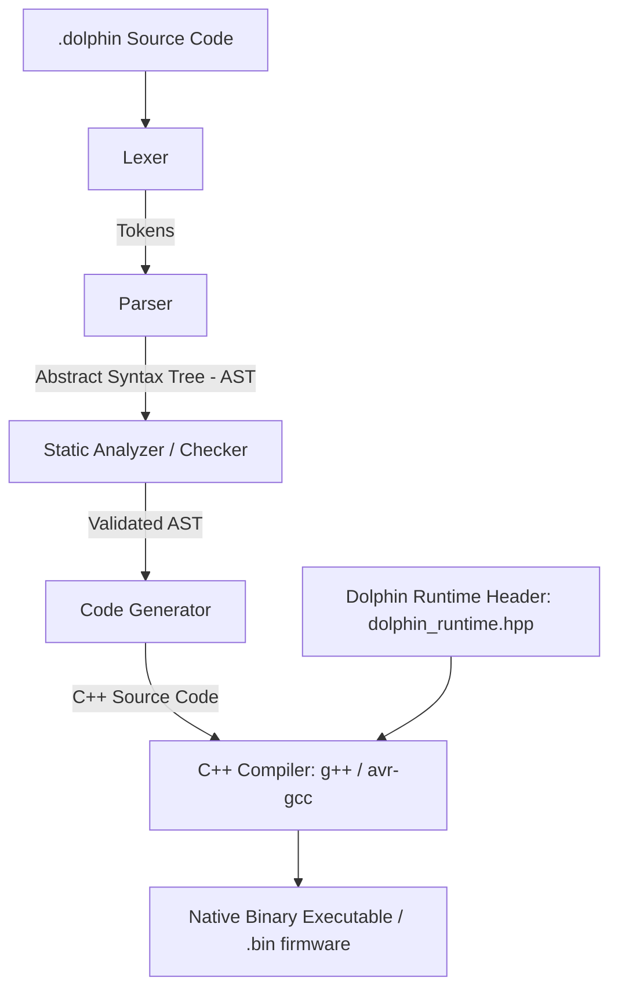

# Dolphin Language: Complete Tutorial & Architecture Guide

Welcome to the official **Dolphin Language Tutorial and Architecture Guide**. Dolphin is a lightweight, compiled programming language designed specifically for IoT, microcontrollers (like ESP32 and Arduino), and embedded systems. It offers the **simplicity and event-driven syntax of JavaScript/Node.js**, combined with the **high performance and low memory footprints of native C++**.

This document covers every single syntax construct, library function, and under-the-hood compiler architecture of Dolphin.

---

# Part 1: Architecture (How Dolphin Compiles to C++)

Dolphin is a **transpiled language**. It does not run on a slow interpreter or virtual machine. Instead, it compiles directly to highly optimized C++ code, which is then compiled to machine code by standard C++ compilers (like `g++` or `avr-gcc`).

Here is the compilation pipeline:



### 1. The Lexer (`lexer.cpp`)
The lexer reads the source file character-by-character and groups them into meaningful **Tokens** (such as identifiers, keywords, literals, and operators), while tracking line and column numbers.

### 2. The Parser (`parser.cpp`)
Using a recursive-descent parsing algorithm, the parser consumes tokens and organizes them into an **Abstract Syntax Tree (AST)**. The AST is a structured tree representing the logical hierarchy of the code.

### 3. The Static Analyzer / Checker (`checker.cpp`)
Before any C++ code is generated, the AST is validated by the static checker:
*   **Scope Tracking**: Verifies block-level scoping and prevents redeclaring variables in the same scope.
*   **Declaration Safety**: Ensures all variables, constants, functions, and classes are declared before use.
*   **Constant Validation**: Confirms that variables declared with the `const` keyword are never reassigned.
*   **Type Validation**: Enforces basic type sanity (e.g., matching types for literals, ensuring `pin` types are initialized only with Pin constructors).

### 4. Code Generator (`generator.cpp`)
The generator walks the validated AST and outputs a single `.cpp` file. 
*   **Type Mapping**: To maintain JavaScript's dynamic style while compiling to C++, Dolphin maps types to a custom dynamic variant type called `var`.
*   **Primitive Types mapping**: Declared types like `int`, `string`, `bool`, `double`, and `float` are mapped to `var` in C++, while the static checker guarantees their safety at compile-time.
*   **Main Entrypoint**: Any top-level code is compiled inside the C++ `main()` function, after running runtime initialization routines.

### 5. Runtime Library (`dolphin_runtime.hpp`)
Dolphin's runtime is a single, header-only C++ library containing the implementation of the `var` variant class, the asynchronous `EventLoop`, and various namespaces. Because it compiles to native code:
*   It has **no virtual machine (VM)** and **no garbage collector**.
*   All data allocations use C++ stack variables or lightweight reference-counting smart pointers (`std::shared_ptr`), allowing it to run smoothly on devices with as little as 32KB RAM.

---

# Part 2: Language Syntax & Core Constructs

## 1. Variables and Constants

Dolphin supports dynamic variables (`var`) as well as static type checking keywords for safety.

```javascript
# Dynamic Variable
var name = "Dolphin"
name = 2.0  # Allowed (dynamic re-assignment)

# Constants (Must be initialized and cannot be reassigned)
const pi = 3.14159
# pi = 3.0  # ERROR: Static checker catches this!

# Typed Primitives (Enforces compile-time type validation)
int age = 10
string city = "Kathmandu"
bool isOnline = true
double score = 98.5
float temp = 24.5f

# Type Mismatches are caught at compile-time:
# int count = "hello"  # ERROR: Static checker throws a type mismatch error!
```

## 2. Basic Operators

Dolphin supports arithmetic, comparison, logical, and bitwise operators.

```javascript
# Arithmetic
add = 10 + 5
sub = 10 - 5
mul = 10 * 5
div = 10 / 5
mod = 10 % 5

# Compound Assignments
x = 5
x += 2
x -= 1
x *= 3
x /= 2

# Comparisons
isEqual = (10 == 10)
isNotEqual = (10 != 5)
isGreater = (10 > 5)
isLess = (5 < 10)

# Logical
andOp = true && false
orOp = true || false
notOp = !true

# Bitwise (Essential for shift registers and binary protocols)
andBit = 5 & 1    # Bitwise AND
orBit = 5 | 2     # Bitwise OR
xorBit = 5 ^ 3    # Bitwise XOR
notBit = ~5       # Bitwise NOT
leftShift = 1 << 3 # Left Shift
rightShift = 8 >> 1 # Right Shift
```

## 3. Control Flow

### If/Else Statements
```javascript
temp = 32.5

if temp > 35 {
    print("It's too hot!")
} else if temp > 25 {
    print("Normal weather.")
} else {
    print("Cold weather.")
}
```

### Pattern Matching (`match`)
Rust-like switch alternative. Highly readable and optimized under the hood:
```javascript
state = HIGH

match state {
    HIGH => print("Turning LED ON"),
    LOW  => print("Turning LED OFF"),
    _    => print("Unknown State") # Default fallback
}
```

## 4. Loops

### While Loop
```javascript
count = 0
while count < 5 {
    print("Count is: " + count)
    count += 1
}
```

### Range Loop
```javascript
for i in range(0, 5) {
    print("Index: " + i) # Prints 0, 1, 2, 3, 4
}
```

### For-Each Loop
Iterate over arrays, lists, or object keys:
```javascript
fruits = ["Apple", "Mango", "Banana"]
for fruit in fruits {
    print("Fruit: " + fruit)
}
```

### Infinite Loop (`loop`)
Commonly used in microcontroller applications:
```javascript
loop {
    print("Polling sensor...")
    sleep(1000)
}
```

### Loop Interrupts
```javascript
for i in range(0, 10) {
    if i == 5 {
        break # Exit loop
    }
    if i % 2 == 0 {
        continue # Skip to next iteration
    }
    print(i)
}
```

## 5. Functions & Lambdas

### Standard Functions
```javascript
fn greet(user) {
    return "Hello, " + user + "!"
}
print(greet("Developer"))
```

### Anonymous Functions (Lambdas)
Passed as parameters for callbacks or operations:
```javascript
runCallback = fn(msg) {
    print("Callback message: " + msg)
}
runCallback("Hello Dolphin!")
```

## 6. Arrays (Lists)

Arrays are dynamic lists under the hood powered by C++ vectors, but share reference semantics (pointers) to save memory.

```javascript
numbers = [10, 20, 30]

# Add elements
numbers.push(40)
numbers.add(50)

# Get size
size = numbers.size() # 5

# Access elements
print("First: " + numbers[0])

# Array Iteration Methods
numbers.forEach(fn(num) {
    print("Num: " + num)
})

# Filter (Create filtered list)
greaterThan20 = numbers.filter(fn(x) {
    return x > 20
})

# Map (Transform elements)
doubled = numbers.map(fn(x) {
    return x * 2
})
```

## 7. Objects (Dictionaries)

Dolphin objects store key-value properties and methods.

```javascript
# Create Object literal
device = {
    "id": "ESP32-01",
    "status": "online",
    "turnOn": fn() {
        print("Device is booting...")
    }
}

# Access properties (Dot or Bracket notation)
print("Device ID: " + device.id)
print("Status: " + device["status"])

# Call method
device.turnOn()

# Helper Methods
hasId = device.has("id")    # Check key existence (true)
keys = device.keys()        # Get list of keys: ["id", "status", "turnOn"]
values = device.values()    # Get list of values
entries = device.entries()  # Get list of key-value pairs
```

### Custom `toString` Implementation
You can override `toString` on objects to customize how they print:
```javascript
customObj = {
    "name": "SensorA",
    "toString": fn() {
        return "Custom Object: SensorA"
    }
}
print(customObj) # Prints: "Custom Object: SensorA"
```

## 8. Classes (OOP)

Dolphin supports basic class syntax with constructor logic using properties.

```javascript
class Light {
    init(pinNum) {
        self.pin = Pin(pinNum, OUTPUT)
        self.state = LOW
    }

    turnOn() {
        self.pin.write(HIGH)
        self.state = HIGH
        print("Light turned ON")
    }

    turnOff() {
        self.pin.write(LOW)
        self.state = LOW
        print("Light turned OFF")
    }
}

# Instantiate class
myLight = new Light(13)
myLight.turnOn()
```

## 9. List Comprehensions

Write short, expressive transformations of containers:

```javascript
nums = [1, 2, 3, 4, 5]

# Square even numbers
squares = [x * x for x in nums if x % 2 == 0]
print(squares) # Prints: [4, 16]
```

## 10. Exception Handling (`try`/`catch`/`throw`)

Dolphin supports standard error propagation and recovery:

```javascript
fn divide(a, b) {
    if b == 0 {
        throw "DivisionByZeroError"
    }
    return a / b
}

try {
    result = divide(10, 0)
} catch (err) {
    print("Caught error: " + err)
} finally {
    print("Execution completed.")
}
```

---

# Part 3: Standard Built-in Namespaces

## 1. Math Namespace
```javascript
val = Math.sin(1.5)
absVal = Math.abs(-10)
power = Math.pow(2, 8)
sqRoot = Math.sqrt(16)
rounded = Math.round(3.6)
floored = Math.floor(3.6)
ceiled = Math.ceil(3.2)
randomVal = Math.random() # Returns double between 0.0 and 1.0
```

## 2. JSON Namespace
```javascript
obj = {"name": "Esp", "version": 2}
jsonStr = JSON.stringify(obj) # Convert to JSON string
parsed = JSON.parse(jsonStr)  # Parse back to Dolphin Object
```

## 3. File Namespace (File System operations)
```javascript
# Write to file
File.write("data.txt", "Hello Dolphin")

# Append to file
File.append("data.txt", "\nSecond line")

# Read from file
content = File.read("data.txt")

# Check file existence
exists = File.exists("data.txt")

# Remove file
File.remove("data.txt")
```

## 4. Date Namespace (Date and Time API)
```javascript
# Get timestamp in milliseconds
ts = Date.now()

# Instantiate Date Object
d = new Date()
print("Year: " + d.year())
print("Month: " + d.month())
print("Day: " + d.day())
print("Hour: " + d.hour())
print("Minute: " + d.minute())
print("Second: " + d.second())
print("Millisecond: " + d.millisecond())
print("Timestamp: " + d.getTime())
print("Formatted string: " + d.toString()) # Format: YYYY-MM-DD HH:MM:SS
```

## 5. Timers & Async/Await

### Event Loop Timers (Non-blocking)
```javascript
# One-shot Timer
setTimeout(fn() {
    print("Runs after 2 seconds")
}, 2000)

# Recurring Timer
intervalId = setInterval(fn() {
    print("Runs every 1 second")
}, 1000)

# Synchronous blocking pause
sleep(500)
```

### Promises & Async/Await
```javascript
fn fetchSensorData() {
    promise = var.Promise()
    
    setTimeout(fn() {
        promise.resolve(25.4)
    }, 1000)
    
    return promise
}

# Await the resolved value
data = await fetchSensorData()
print("Received: " + data)
```

---

# Part 4: Microcontroller & Hardware Namespace

## 1. GPIO & Pins
```javascript
# Define Pins
pin led = Pin(13, OUTPUT)
pin button = Pin(2, INPUT)

# Write to Pins
led.write(HIGH)
led.write(LOW)

# Read Pin state
val = button.read()
```

## 2. Asynchronous Pin Listeners (Change Interrupts)
Listen to hardware interrupts asynchronously.
```javascript
button = Pin(2, INPUT)

button.on("change", fn(state) {
    if state == HIGH {
        print("Button was pressed!")
    } else {
        print("Button was released!")
    }
})
```
*   *Note*: When compiling for a PC Target, if an event is triggered on the main thread, the callback is executed synchronously. If triggered from a background thread (e.g. socket read loop), the callback is queued and executed thread-safely inside the `EventLoop` thread.

## 3. Peripheral Modules (IoT namespaces)
```javascript
# Wifi connection
Wifi.connect("MySSID", "MyPassword")

# Process control
Process.exit(0)
```
